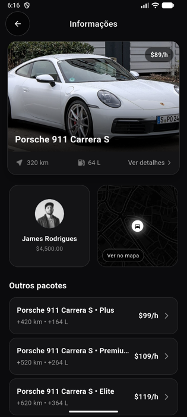
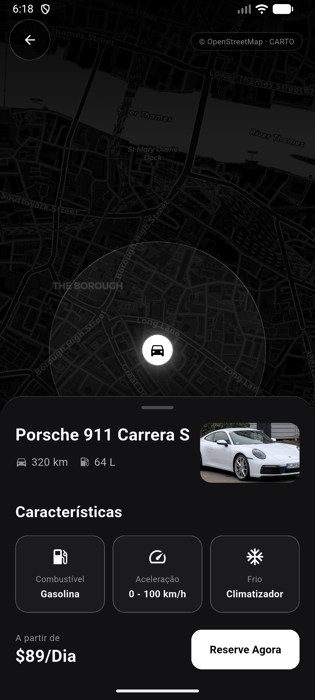
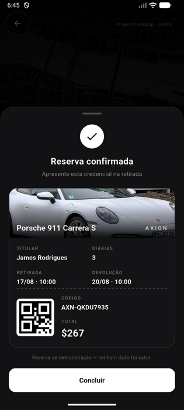

# Axion

App de aluguel de carros premium feito em Flutter. Interface escura, catálogo com
foto de cada modelo, mapa em tema noturno e uma credencial de reserva.

| Boas-vindas | Catálogo | Informações | Mapa | Reserva |
|---|---|---|---|---|
|  |  |  |  |  |

## O que tem dentro

- **Catálogo de carros** — cada modelo com a sua própria foto, preço por diária,
  autonomia e capacidade do tanque.
- **Mapa escuro** — tiles *Dark Matter* da CARTO sobre dados do OpenStreetMap,
  com marcador animado do carro e raio de cobertura.
- **Credencial de reserva** — comprovante fictício gerado na hora, com código,
  datas e total calculado. **Nada é gravado em banco de dados.**
- **Arquitetura em camadas** — `data` / `domain` / `presentation`, com BLoC para
  estado, GetIt para injeção de dependências e Firestore como fonte de dados.

## Rodando o projeto

Requer Flutter 3.41 ou superior (Dart 3.11).

```bash
git clone <url-do-repositorio>
cd app_axion
flutter pub get
```

### Configuração do Firebase (obrigatória)

Os arquivos com as credenciais do Firebase **não fazem parte do repositório**
(estão no `.gitignore`), então é preciso gerar os seus antes de rodar:

```bash
dart pub global activate flutterfire_cli
flutterfire configure
```

Isso recria o `lib/firebase_options.dart` e o `android/app/google-services.json`
apontando para o seu projeto no Firebase. Sem esse passo o app não compila,
porque o `main.dart` importa o `firebase_options.dart`.

Depois é só rodar:

```bash
flutter run
```

### Testes

```bash
flutter test
```

## Estrutura

```
lib/
├── data/            # modelo Car, catálogo de fotos, datasource do Firestore
├── domain/          # repositórios e casos de uso
└── presentation/
    ├── bloc/        # estado da listagem de carros
    ├── pages/       # telas (onboarding, lista, informações, mapa)
    │   └── widgets/ # cards, mapa escuro, credencial de reserva
    └── theme/       # paleta e ThemeData do app
```

## Sobre o mapa

Os tiles vêm da CARTO e **não precisam de chave de API** — é um endpoint público,
como o do OpenStreetMap. Não há nenhuma credencial de mapa no código.

Em compensação, o uso exige que os créditos apareçam na tela, e eles estão no
canto superior direito do mapa. Não remova.

## Créditos e licenças

As fotos dos carros vieram do Wikimedia Commons sob licença CC BY-SA 4.0, que
**exige atribuição**. A lista completa com autor, licença e link de cada imagem
está em [CREDITS.md](CREDITS.md).
